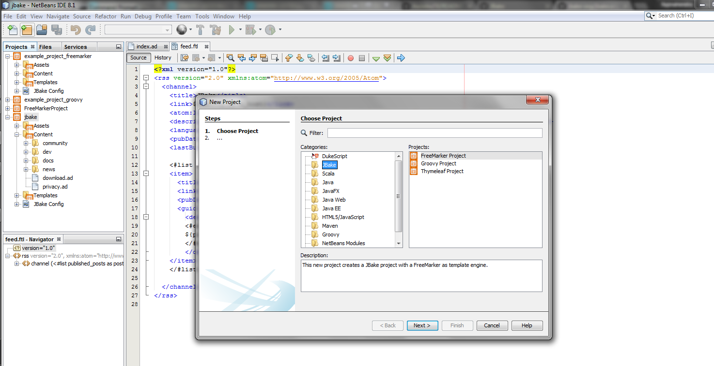

# NetBeans JBake Plugin
[NetBeans](http://netbeans.org) plugin for [JBake](http://jbake.org) Project. Create a new JBake project using NetBeans IDE to create your static website, blogs etc with the help of all your favoirte NetBeans Plug-ins like HTML, CSS, JavaScript, Groovy, Markdown and more.

# Prerequisites 
* NetBeans 8.1 or higher
* Java 7

Supports JBake v2.4.0

# About JBake
JBake is a Java based, open source, static site/blog generator for developers & designers
To know more please visit JBake Website

# Currently Supports
1. Create a JBake project using
  * FreeMarker
  * Groovy
  * Thymeleaf

2. Create content files using
  * Markdown
  * HTML
  * AsciiDoc

3. Open a JBake Project

# TODO
* Recognize JBake Home or use inbuilt JBake
* Generate Site
* Live Editing
* and more...

# Screenshot

